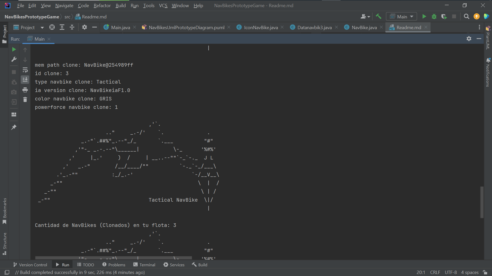
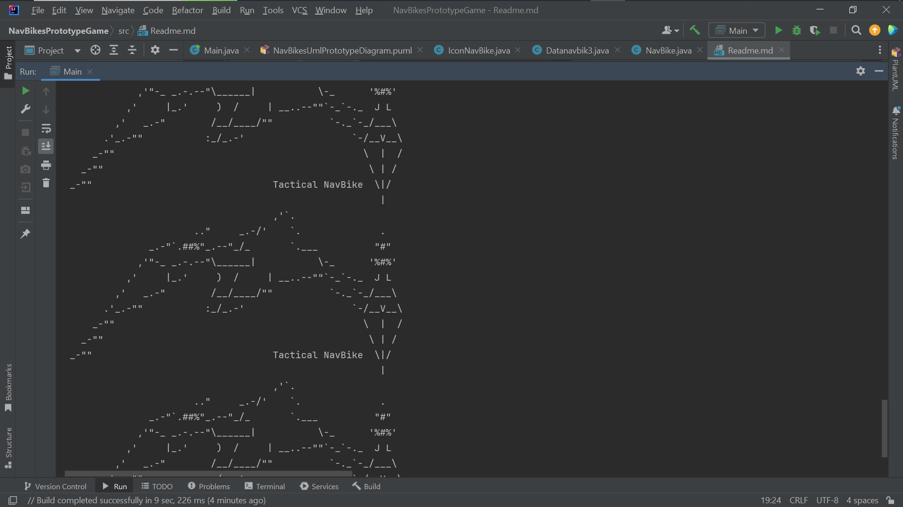
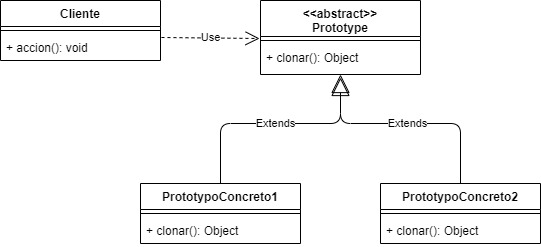
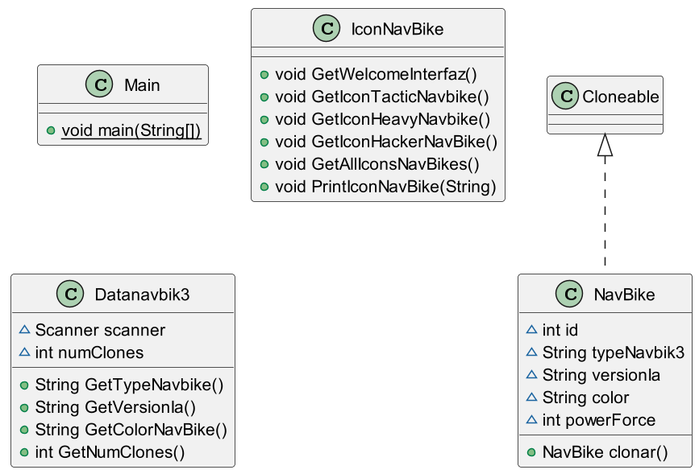

**_NavBikes (Prototype/Clone) object iaSyst3m**_ 

**_Version 1.1_**

**_@author: Mauricio Restrepo Marín._**

El siguiente código permite la creación y clonación en tiempo de ejecución de prototipos de naves espaciales tipo ASCII, denominadas NavBikes. Este enfoque resulta especialmente útil cuando se necesita crear un escuadrón o una flota de NavBikes sin consumir excesivos recursos de memoria RAM en la máquina.

El patrón de diseño utilizado es el Prototipo, el cual proporciona una manera eficiente y sencilla de gestionar la creación y clonación de objetos incluyendo sus **_atributos y metodos_**. Al utilizar prototipos previamente creados, se evita la duplicación innecesaria de recursos y se optimiza el rendimiento del sistema.

La capacidad de clonación en tiempo de ejecución permite generar múltiples instancias de NavBikes a partir de un prototipo base, con la flexibilidad de ajustar las propiedades de cada clon según sea necesario. Esto facilita la creación y gestión de escuadrones de naves espaciales de manera dinámica y eficiente.

Para hacerlo, la arquitectura del codigo fuente, implementa: el **_Patrón de Diseño Creacional_** : **_Prototype_**, el cual implementa a su vez una **_Interfaz(I)_** nativa del **_Java JDK_**, llamada **_Cloneable_**, diseñada especificamente para Clonar nuevos Objetos de una manera ágil y encapsulando el proceso.

**_Patrón PROTOTYPE_**

**_Nombre:_** PROTOTYPE

_**Problema:**_ Uso excesivo de memoria y tiempo al crear objetos costosos en tiempo de ejecución.

**_Solución:_** Copiar un objeto existente en vez de crear uno nuevo. El objeto existente actúa como un prototipo y contiene el estado del objeto que va a ser “creado” incluyendo sus atributos y metodos.

**_Consecuencias:_**

**_Ventajas:_** Crear y eliminar objetos en tiempo de ejecución, permite definir un nuevo comportamiento a través de la composición de objetos (especificando el valor de sus variables).

**_Desventajas:_** Es una manera muy robusta de solucionar la creación de objetos costosos si no se crean muchos objetos de manera dinámica, oculta las dependencias del cliente, todas las clases tienen que implementar un método CLONE() para poder “crear” un nuevo objeto.

El cliente es quien tiene los prototipos concretos para poder clonarlos. Esto se puede modificar poniendo un store de prototipos entre el cliente y los prototipos. Funcionando este de vínculo entre ambos, agregándole una abstracción más al cliente. El no sabría que se están clonando los objetos, lo único que sabe es que pide un objeto y lo recibe. El diagrama quedaría de la siguiente manera:

**PlantUml Prototype Diagram NavBikes app**_: 

