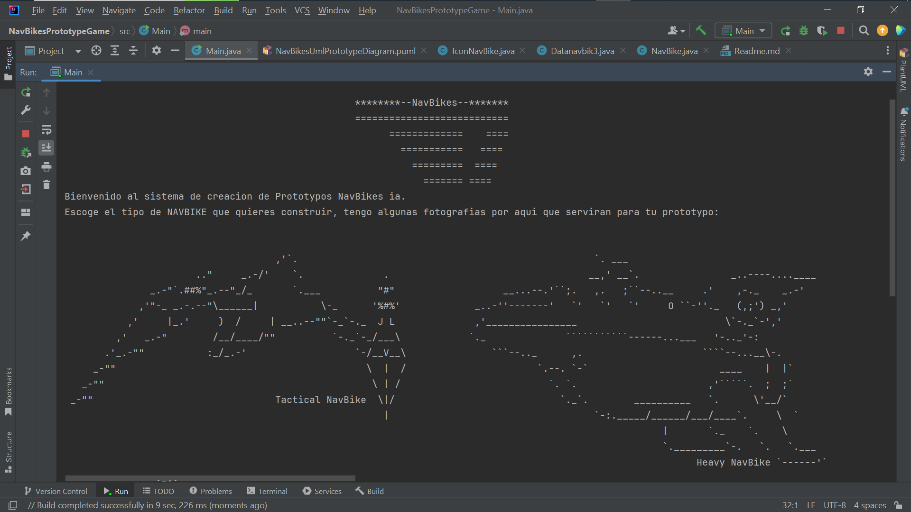
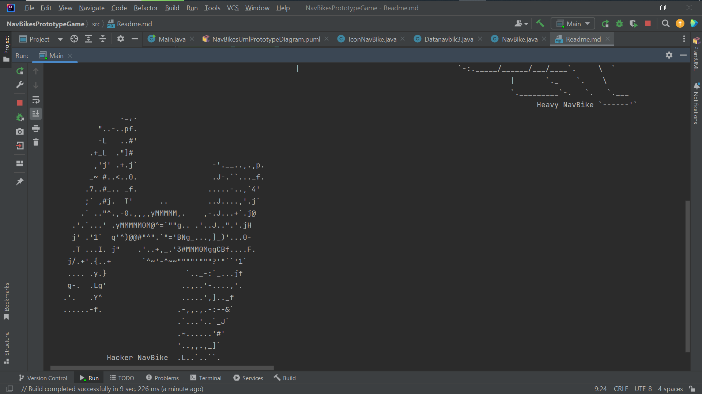
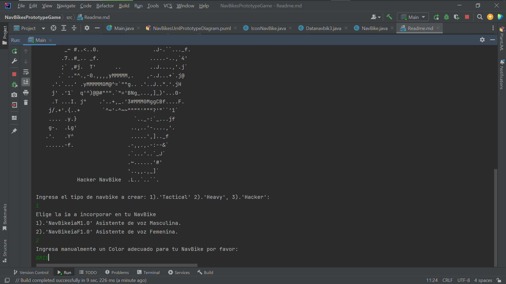
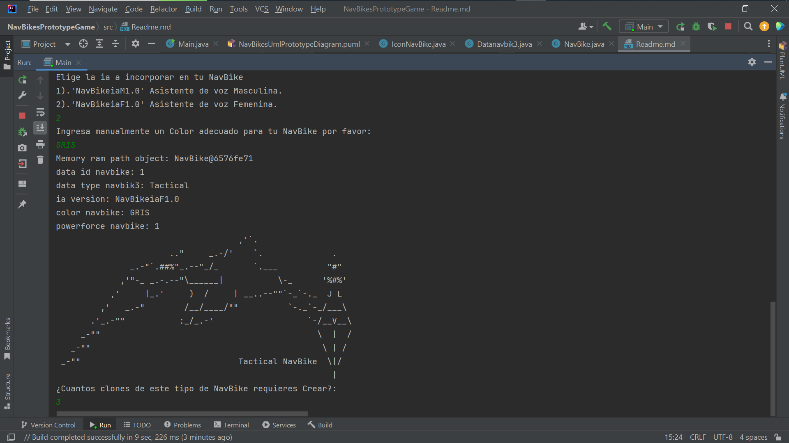
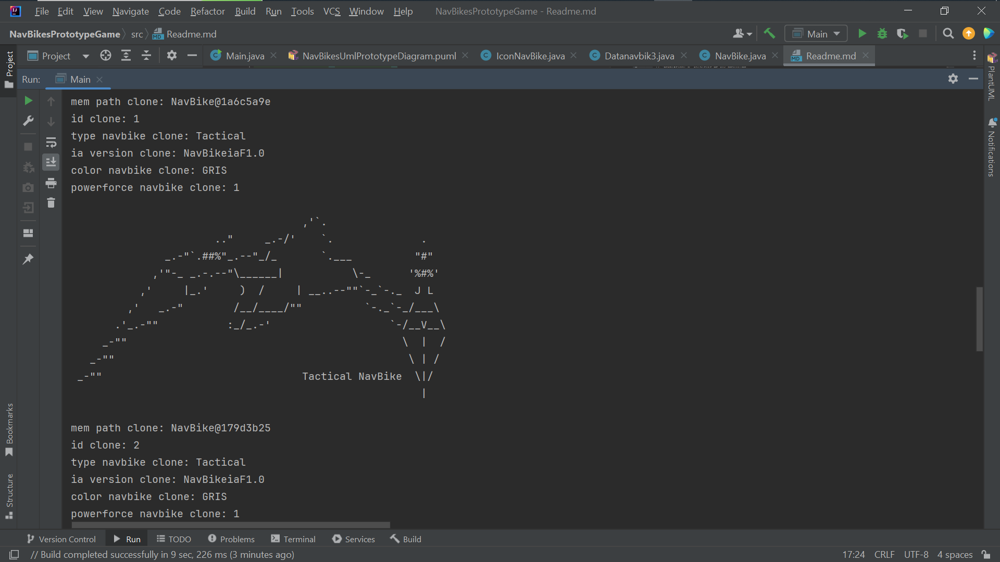
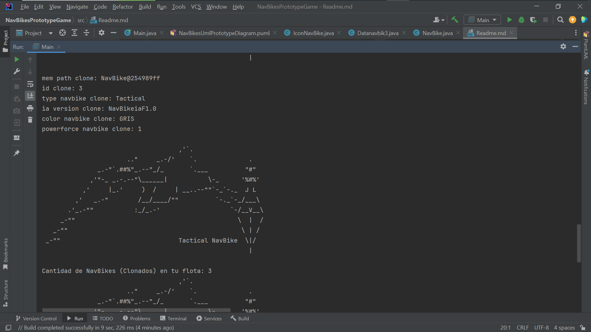
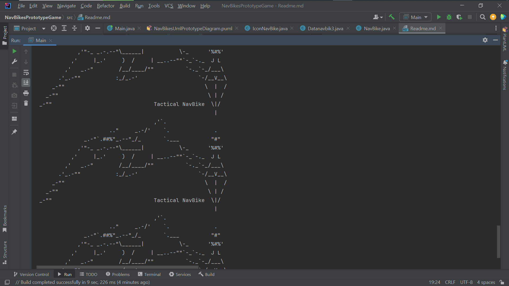
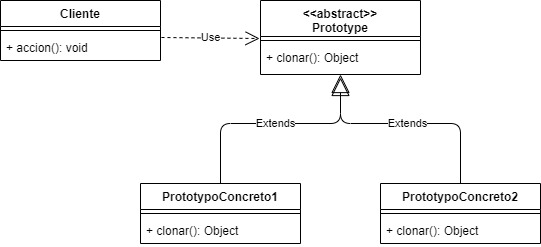
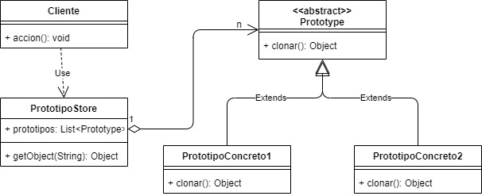
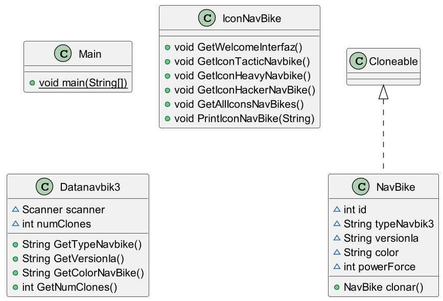

**_NavBikes (Prototype/Clone) object iaSyst3m**_ 

**_Version 1.1_**

**_@author: Mauricio R._**

El siguiente codigo permite tanto la creación de Prototipos de naves espaciales tipo ASCII llamadas: **_NavBikes_**, así cómo la Clonación en tiempo de ejecución, del prototipo previamente creado, 
algo útil cuando se requiere **_Crear_** un escuadron, o una flota de NavBikes sin utilizar demasiados recursos en la maquina como memoria (Ram) de manera fácil y  a partir de un Prototypo previamente creado.

Para hacerlo, la arquitectura del codigo fuente, implementa: el **_Patrón de Diseño Creacional_** : **_Prototype_**, el cual implementa a su vez una **_Interfaz(I)_** nativa del **_Java JDK_**, llamada **_Cloneable_**, diseñada especificamente para Clonar nuevos Objetos de una manera ágil y encapsulando el proceso.

**_Patrón PROTOTYPE_**

**_Nombre:_** PROTOTYPE

_**Problema:**_ Uso excesivo de memoria y tiempo al crear objetos costosos en tiempo de ejecución.

**_Solución:_** Copiar un objeto existente en vez de crear uno nuevo. El objeto existente actúa como un prototipo y contiene el estado del objeto que va a ser “creado”.

**_Consecuencias:_**

**_Ventajas:_** Crear y eliminar objetos en tiempo de ejecución, permite definir un nuevo comportamiento a través de la composición de objetos (especificando el valor de sus variables).

**_Desventajas:_** Es una manera muy robusta de solucionar la creación de objetos costosos si no se crean muchos objetos de manera dinámica, oculta las dependencias del cliente, todas las clases tienen que implementar un método CLONE() para poder “crear” un nuevo objeto.

El cliente es quien tiene los prototipos concretos para poder clonarlos. Esto se puede modificar poniendo un store de prototipos entre el cliente y los prototipos. Funcionando este de vínculo entre ambos, agregándole una abstracción más al cliente. El no sabría que se están clonando los objetos, lo único que sabe es que pide un objeto y lo recibe. El diagrama quedaría de la siguiente manera:

**PlantUml Prototype Diagram NavBikes app**_: 

